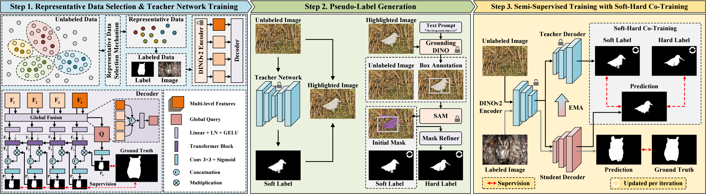
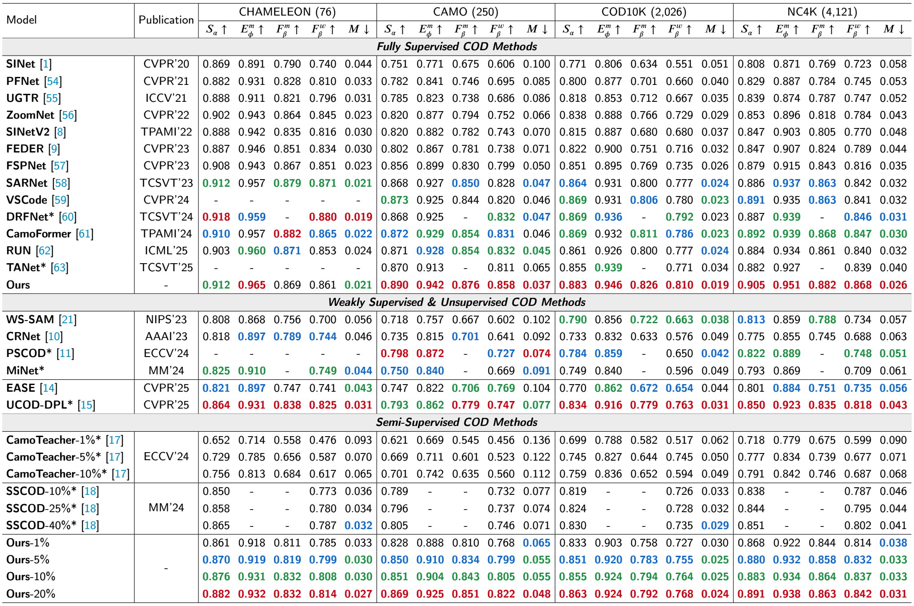
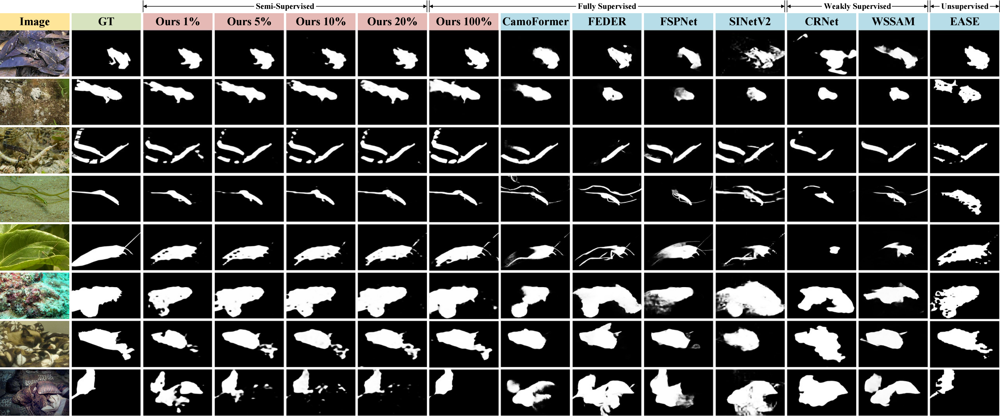

# Boosting Semi-Supervised Camouflaged Object Detection with Representative Samples and Better Labels (KBS 2026)

> **Authors:**
> Chunyuan Chen,
> Weiyun Liang,
> Ji Du,
> Xinjian Wei,
> Bing Wang,
> Jing Xu*,
> and Frank Jiang.

## 1. Overview

- This repository provides code for "_**Boosting Semi-Supervised Camouflaged Object Detection with Representative Samples and Better Labels**_", Knowledge-Based Systems, 2026. [[Paper]](https://www.sciencedirect.com/science/article/abs/pii/S095070512600064X) 

### 1.1 Introduction

Camouflaged object detection (COD) aims to accurately localize and segment targets that are visually blended into complex backgrounds. For a better practical application, semi-supervised COD offers a promising compromise between annotation efficiency and detection accuracy, compared to fully supervised, weakly supervised, and unsupervised counterparts. However, it remains hindered by biased teacher training and the generation of low-quality pseudo-labels. To address these challenges, we propose RSBL, a novel semi-supervised COD framework that enhances learning with representative image selection and high-quality pseudo-labeling. Specifically, we introduce a representative data sampling mechanism that constructs a labeling subset capturing the diversity of the dataset, thereby improving the robustness of the teacher network across diverse camouflage scenarios. Furthermore, we design an automatic hard label generation mechanism that leverages vision foundation models to refine the pseudo-label quality. A soft–hard co-training strategy is also incorporated to reduce learning difficulty and enhance training quality. Extensive experiments and analyses on multiple benchmarks demonstrate that our proposed framework achieves superior performance and strong generalizability, particularly with extremely limited annotations, highlighting its potential for real-world COD applications.

### 1.2 Framework

<p align="center">
     <br />
    <em> 
    <b>Figure 1:</b> Our proposed <b>RSBL</b> framework, which consists of three steps: <b>Representative Data Selection & Teacher Network Training</b>, <b>Pseudo-Label Generation</b>, and <b>Semi-Supervised Training with Soft-Hard Co-Training</b>. The soft label and hard label of the unlabeled image are <b>updated per iteration</b> during Step 3.
    </em>
</p>

### 1.3 Quantitative Results

<p align="center">
     <br />
    <em> 
    <b>Table 1:</b> Quantitative comparisons with different methods on four COD datasets. For each category, the 1st, 2nd, and 3rd best results are shown in red, green, and blue.
    </em>
</p>

### 1.4 Qualitative Results

<p align="center">
     <br />
    <em> 
    <b>Figure 2:</b> Qualitative comparison with SOTA methods, including fully supervised, weakly-supervised, and unsupervised methods.
    </em>
</p>

## 2. Proposed Framework

### 2.0 Environment

python = 3.9

torch = 2.0.0

### 2.1 Prepare the Data

The training and testing datasets can be downloaded from https://github.com/GewelsJI/SINet-V2.

The pre-trained DINOv2 model weights can be downloaded from https://github.com/facebookresearch/dinov2.

1. Fork DINOv2 from https://github.com/facebookresearch/dinov2, and place it in the main folder like `./dinov2/...`. Download the pre-trained DINOv2-base model weights, and move it to `./dinov2_vitb14_pretrain.pth`.

2. Put the training data in folder `./Dataset/TrainDataset`, and put the testing data in folder `./Dataset/TestDataset`.

3. `TrainDataset` should contain two folders: `Imgs` and `GT`. 

4. `TestDataset` should contain four folders: `CHAMELEON`, `CAMO`, `COD10K`, and `NC4K`. Each of the four folders contains two sub-folders: `Imgs` and `GT`.

### 2.2 Training Configuration

+ Training hyperparameters and data paths can be modified in `./configs/base_model_config.py` and `./configs/ts_model_config.py`

+ Installing necessary packages:
   + DINOv2: Please follow the installation instructions in https://github.com/facebookresearch/dinov2.
   + sklearn: https://scikit-learn.org/stable/index.html
   + pysodmetrics: https://github.com/lartpang/PySODMetrics
  
### 2.3 Training, Inference, and Testing

1. Run `kmeans_sample.py` to generate the selected training samples (as a .txt file), and move this file to `./Dataset/TrainDataset/sampled_images.txt`.

2. Run `train_base_model.py` to pre-train the teacher model, and use `inference.py` to generate the teacher-predicted pseudo labels on unlabeled data.

3. Use [Grounded-SAM](https://github.com/IDEA-Research/Grounded-Segment-Anything) to generate pseudo labels for unlabeled data.
   
   You can use the following code to generate a "Highlighted Image" for a specific unlabeled image.

   Once you obtain the SAM-predicted pseudo labels for all the unlabeled data, put these masks in `./Dataset/SAMLabel/sampled_masks/`.
   
  ```python
  import cv2
  import numpy as np

  def GenerateHighlightedImage(source_image_path, mask_image_path, output_image_path, alpha=0.5):
    source_image = cv2.imread(source_image_path)
    mask_image = cv2.imread(mask_image_path, cv2.IMREAD_GRAYSCALE)

    if source_image is None or mask_image is None:
        print("Unable to load the image, please check the image path!")
        return

    mask_image = cv2.resize(mask_image, (source_image.shape[1], source_image.shape[0]))

    mask_image_normalized = mask_image / 255.0

    mask_color = (255, 255, 255)
    highlighted_image_image = np.uint8((1 - alpha * mask_image_normalized[:, :, np.newaxis]) * source_image + alpha * mask_image_normalized[:, :, np.newaxis] * mask_color)

    cv2.imwrite(output_image_path, highlighted_image_image)

  import os
  from tqdm import tqdm
  data_path = 'path to unlabeled images'
  mask_path = 'teacher-predicted pseudo masks on unlabeled images'
  data_save_path = 'path to save the highlighted images'

  image_list = os.listdir(mask_path)
  image_list = [name for name in image_list if name.endswith('.jpg') or name.endswith('.png')]
  alpha = 0.5

  for img_name in tqdm(image_list):
      source_image_path = os.path.join(data_path, img_name.replace('.png', '.jpg'))
      mask_image_path = os.path.join(mask_path, img_name)
      output_image_path = os.path.join(data_save_path, img_name.replace('.png', '.jpg'))
      GenerateHighlightedImage(source_image_path, mask_image_path, output_image_path, alpha)
  ```

5. Run `train_ts_model.py` to train the teacher-student network. Remember to modify the path to your pre-trained teacher model checkpoints (Line 23).

6. Run `inference.py` to generate the prediction maps. Set the path to your trained student checkpoint (Line 38).

7. Run `evaluate.py` to calculate the evaluation metrics for the prediction maps. Set the path to your predictions (Line 29).

## 3. Pre-computed Maps

+ Pre-computed Maps: 
   + 1% Training Data: [Google Drive](https://drive.google.com/drive/folders/1Ljd9nxno9qznMyEmQKohbXD8-vRZmAmu?usp=sharing)
   + 5% Training Data: [Google Drive](https://drive.google.com/drive/folders/1tPLR9Jsnymsfv4LvDSCX3rX4_OrQOiJp?usp=sharing)
   + 10% Training Data: [Google Drive](https://drive.google.com/drive/folders/1K2a_9zsXunrtY7Q_JHL_hl7tHqfPS-Ez?usp=sharing)
   + 20% Training Data: [Google Drive](https://drive.google.com/drive/folders/1J5lJPwaAoSFuyk1-rW95joGVkmXEbkNe?usp=sharing)
   + 100% Training Data: [Google Drive](https://drive.google.com/drive/folders/1vZ9489HTCsP1AMvBV-ZqWIcZdWnrTW2k?usp=sharing)

## 4. Citation

If you find our work useful, please consider citing our paper:
	
    @article{CHEN2026115320,
      title = {Boosting Semi-Supervised Camouflaged Object Detection with Representative Samples and Better Labels},
      journal = {Knowledge-Based Systems},
      pages = {115320},
      year = {2026},
      doi = {https://doi.org/10.1016/j.knosys.2026.115320},
      author = {Chunyuan Chen and Weiyun Liang and Ji Du and Xinjian Wei and Bin Wang and Jing Xu and Frank Jiang},
    }

## Contact
If you have any questions, please feel free to contact me via email at chunyuanchen113@gmail.com or 2120240549@mail.nankai.edu.cn.


**[⬆ back to top](#1-overview)**
